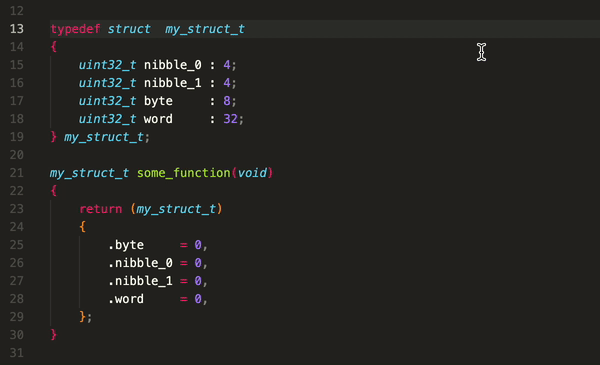

# C Toolkit

A VSCode extension to help create, build, run, debug and test C and C++ projects
using CMake.

## Features

- [Status bar buttons](#status-bar-buttons).
- [Command for creating a new project](#project-generation).
- [Command for generating a new component (library)](#component-generation).
- [Checks for and installs missing build tools](#missing-build-tools).
- [Command for refreshing project VSCode configurations](#refreshing-project-configuration).
- [Snippets](#snippets)

## Important Note

If you find a bug or have a suggestion, please [open a new issue](https://github.com/usmanmehmood55/c-toolkit/issues)
and help me make this extension better. :)

## Requirements

The following tools are required by extension to work properly. If they are not
installed, the extension attempts to install them by itself.

1. GCC
2. GDB
3. CMake
4. Ninja

## Status Bar Buttons

Seven status bar buttons have been implemented to:

- Select build type (Release, Debug)
- Clean
- Build
- Run
- Debug
- Test
- Debug Test

## Project Generation

A new C or C++ project can be created with necessary biolerplate code using
the `C Toolkit: Create New C Project` or `C Toolkit: Create New C++ Project`
commands in the command palette. To access the command palette, use
`ctrl + shift + p`.

It would then ask the user to select a base folder in which the project
folder is to be placed. When a base folder is selected, the user would be
asked to input the project name.

### Project Files

The new project folder would contain these pre-configured items:

- `.vscode` folder
- `CMakeLists.txt`
- `main.c` if it is a C project.
- `main.cpp` if it is a C++ project.

The user can then start adding their own libraries or "components" via the
component generation feature.

## Component Generation

A new component can be created with some biolerplate code by using the
`C Toolkit: Create New Component` command in the command palette. It
would then ask the user to input the component name and give the option
to make the component "mocked" and "tested".

### Mocked Components

"Mocked" means a mock file would be created inside a "mock" folder. If
the component name is `library`, the mock file would be `mock_library.c`.
A CMake variable `ENABLE_LIBRARY_MOCK` is also added to the root CMakeLists
file. It can be enabled during the build invocation to compile the mock source
instead of the actual source.

### Tested Components

"Tested" means test header and source files would be created inside
a "test" folder. If the component name is `library` then the test files
would be `test_library.h` and `test_library.c`. A CMake variable
`ENABLE_LIBRARY_TEST` is also added to the root CMakeLists file. It can be
enabled during the build invocation to compile the test files as well.

### Component Files

A component would have the following files

- `include/component.h`
- `src/component.c`
- `mock/mock_component.c`
- `test/test_component.h`
- `test/test_component.c`
- `CMakeLists.txt`

It would also modify the root CMakeLists.txt to add the new component. Naturally
if the project is C++ instead of C, the `.h` files will be `.hpp` and `.c` files
will be `.cpp`.

## Missing Build Tools

The extension checks if the required build tools are installed by trying to
find them in the `PATH`, if any of them is not detected by the extension it
then offers to install the missing tools.

Once installation of the missing tools is complete, it asks the user if VSCode
can be restarted.

The build tools are installed via these package managers:

- Advance Package Tool (APT) for Linux.
- Homebrew for MacOS.
- Scoop for Windows.

Since Windows does not come pre-installed with Scoop, the ability to install
Scoop itself has also been added. Once the tools are installed, the user is
informed, and asked to close and re-open VS Code.

The command `C Toolkit: Search For Build Tools` in the command palette can also
be used to manually trigger this.

## Refreshing Project Configuration

To refresh the project configurations in the `.vscode` folder, use the command
`C Toolkit: Refresh Configurations` in the command palette. Use this carefully,
as it overwrites previous configurations. For safe usage, the option to backup
previous `.vscode` folder is also provided.

## Snippets

The extension adds useful snippets for creating functions and attributes.

- functions
  - int (`intfunc`)
  - int8_t to int64_t (`int8func`, `int16func`, `int32func`, `int64func`)
  - uint8_t to uint64_t (`uint8func`, `uint16func`, `uint32func`, `uint64func`)
  - float (`flfunc`)
  - double (`doubfunc`)
  
  

- attributes
  - packed (`packed`)
  - aligned (`aligned`)
  - unused (`unused`)
  - weak (`weak`)
  
  
